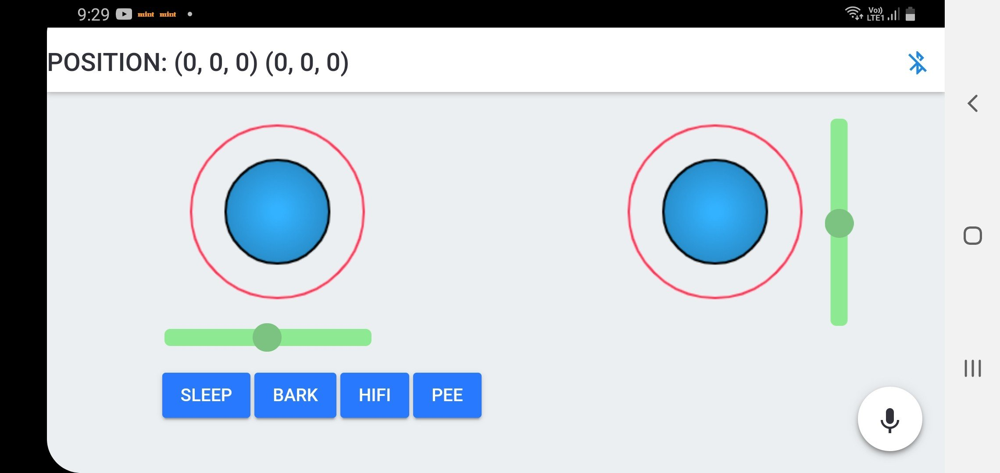

# SpotMicro ESP32
Customized poses with direct servo manipulation and Voice Controls

3D model: https://github.com/michaelkubina/SpotMicroESP32
Master Software: https://github.com/maartenweyn/SpotMicro_ESP32
Forum https://spotmicroai.readthedocs.io/en/latest/

## Action video
[](https://www.youtube.com/watch?v=YhH5K681pzY "App")

## App
Make sure to turn on Bluetooth and Location, and allow required permissions.
Only been tested on Android
[]


## Configure - IMPORTANT
Update configuration for your ESP32 circuit at end of
https://github.com/cholan2100/SpotMicro_ESP32/blob/master/code/esp-idf/ik_test/main/config.h

```c
#define I2C_MASTER_SCL_IO   22    /*!< gpio number for I2C master clock */
#define I2C_MASTER_SDA_IO   23    /*!< gpio number for I2C master data  */
#define I2C_ADDRESS         0x41    /*!< slave address for PCA9685, DEFAULT: 0x40 */
#define SERVO_PWM_MIN       {90,81,90, 95,94,75, 86,100,96, 115,110,85} //FLS,FLU,FLL, FRS,FRU,FRL, RLS,RLU,RLL, RRS,RRU,RRL
//FIXME: max values are guessed from first servo, instead find the actual duty cycleint8_t pwm_channel[12] = 
#define SERVO_PWM_MAX       {510,501,510, 515,514,495, 506,520,516, 525,530,505} //FLS,FLU,FLL, FRS,FRU,FRL, RLS,RLU,RLL, RRS,RRU,RRL

#define SERVO_CHANNELS      {/* FLS,FLU,FLL */ 12,13,14, \
                             /* FRS,FRU,FRL */   8,9,10, \
                             /* RLS,RLU,RLL */   4,5,6, \
                             /* RRS,RRU,RRL */   0,1,2 } 
```


